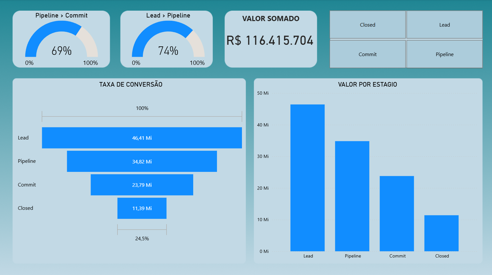
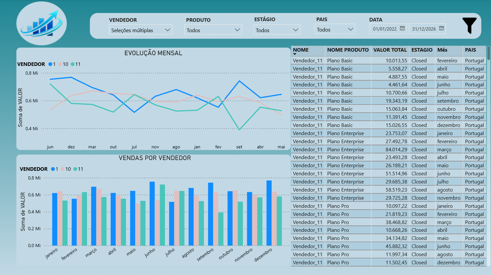

# 📊 Análise Comercial e Pipeline de Vendas – Power BI

Projeto de análise comercial e pipeline de vendas, desenvolvido em **Power BI**, utilizando dados armazenados em **SQL Server**.  
O dashboard permite acompanhar desempenho de vendas, funil comercial, metas, conversões e evolução temporal, com foco em **apoio à tomada de decisão**.

---

## 🎯 Objetivo do Projeto
Transformar dados brutos de vendas em **insights claros e acionáveis**, permitindo:

- Avaliar desempenho comercial
- Identificar gargalos no funil de vendas
- Acompanhar metas e resultados
- Comparar períodos (YoY)
- Analisar performance por vendedor, produto e país

---

## 📈 Principais Análises e KPIs

- 💰 Valor total de vendas  
- 🎯 Meta anual x realizado  
- 🔄 Taxa de conversão por estágio  
- 🧩 Funil comercial (Lead → Pipeline → Commit → Closed)  
- 📅 Evolução mensal, trimestral e semanal  
- 🌍 Análise por país  
- 👤 Desempenho por vendedor  
- 📦 Análise por produto  

---

## 🛠️ Tecnologias Utilizadas

- Power BI Desktop  
- SQL Server  
- DAX  
- Excel (dados de origem)  
- Modelagem dimensional  
- Git & GitHub  

---

## 📸 Preview do Dashboard
> *(imagens ilustrativas)*

---

## ▶️ Como visualizar o dashboard
1. Faça o download do arquivo `.pbix` na pasta `powerbi`
2. Abra o arquivo no **Power BI Desktop**
3. Caso necessário, ajuste o caminho da fonte de dados SQL

---

## 📌 Observações
Os dados utilizados neste projeto são **fictícios** e têm finalidade **educacional e demonstrativa**.
